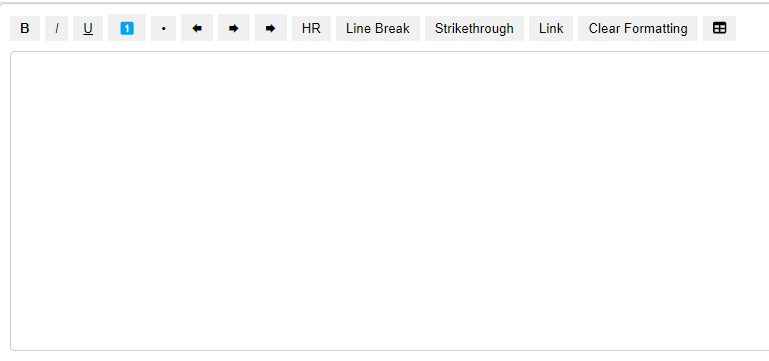

# **LOKI Editor**

**LOKI Editor** is a lightweight, customizable, and feature-rich text editor for web applications. It allows you to format text, insert tables, and handle other rich text features, making it a versatile tool for content editing.



## **Features**

- Text formatting (Bold, Italics, Underline, Strikethrough)
- Lists (Numbered and Bulleted)
- Text alignment (Left, Center, Right)
- Inserting links, tables, and horizontal rules
- Clear formatting option
- Drag-and-drop functionality for text
- Content-editable area with word count tracking

## **Installation**

To install the **LOKI Editor** in your project, use npm:

```bash
npm install loki-editor

Usage
Here’s an example of how you can use LOKI Editor in your React project:

Import the editor component and CSS file:
jsx

import React from 'react';
import TextEditor from 'loki-editor';
import 'loki-editor/dist/TextEditor.css'; // Ensure you import the CSS file for styling
Use the editor component in your React component:
jsx

const App = () => {
  return (
    <div>
      <TextEditor />
    </div>
  );
};

export default App;


Available Features & Options
Text Formatting
Bold: Makes the selected text bold.
Italic: Italicizes the selected text.
Underline: Underlines the selected text.
Strikethrough: Strikes through the selected text.
Lists
Numbered List: Creates an ordered (numbered) list.
Bulleted List: Creates an unordered (bulleted) list.
Text Alignment
Align Left: Aligns the text to the left.
Align Center: Aligns the text to the center.
Align Right: Aligns the text to the right.


Inserting a Table
The handleInsertTable function allows you to insert a table into the editor. You can specify the number of rows and columns, and the editor will create a table with the given dimensions.

Handling Links
The editor allows you to insert a link via the handleInsertLink function, which prompts the user to enter a URL, and then inserts the link into the text.

Custom Styles
You can customize the look and feel of the editor by modifying the TextEditor.css file.

Development
If you'd like to contribute to this project, feel free to clone the repository and submit pull requests. Make sure to follow the coding standards and add meaningful documentation.


## Support or Questions
If you have any questions or need help with the LOKI Editor, feel free to contact me at:

📧 Email: [logesh.b2213@gmail.com]